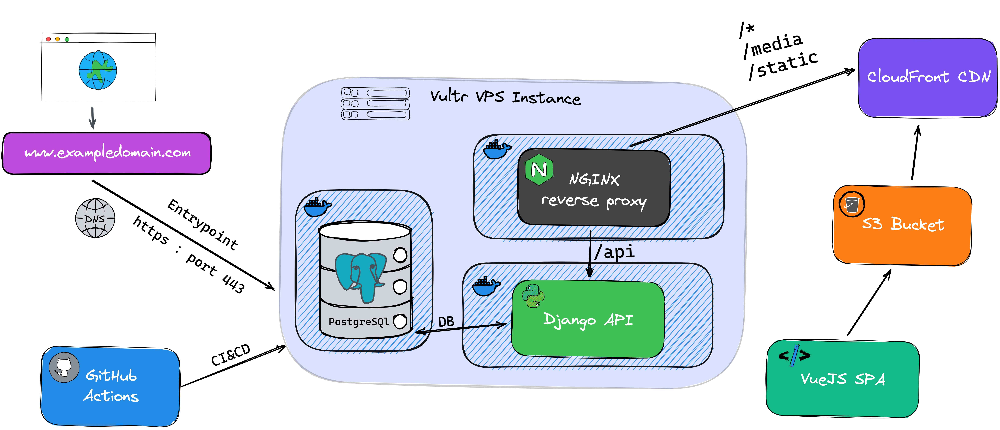

# django-s3-stack

This is a template web app for deploying a static VueJS SPA to S3 with CloudFront hosting, and a Dockerized headless Django REST API to a Vultr VPS instance running the CentOS Linix distro. All deployment is automated and handled through bash scripts running inside Github Actions

The Django API, Nginx reverse proxy, and Postgres db are all deployed on the same Vultr VPS instance. This is only a website template designed to service a small amount of traffic and few concurrent connections. This solution has a tradeoff of not being able to easily scale out due to the `db` and `api` being deployed on the same server. If you wanted to increase the traffic the `api` can process then you'd want to move the `db` instance off the server. 

It would be easier to use AWS or GCP for this as deployment, routing, and managing dockerized apps are all much easier. However I wanted to build something that uses an extremely cheap VPS option so as to make it accessible for smaller clients. The base Vultr plan can run a decent server for $7 a month, which can service 1TB of bandwidth, has a 25GB SSD, 1 dedicated CPU, and they even have Sydney servers!

All of the server deployment, app management/updating, certificate management, secret management, s3 deployment, etc. are all handled through customs scripts which run inside GitHub Actions CICD.

[Stack architecture](https://excalidraw.com/#json=6382989575454720,cvpix8FhYb-QelFCjYZW-A)

[GitHub Actions architecture (out of date)](https://excalidraw.com/#json=5423642091454464,gxzMZ1UnjIQakdN9Mgim2g)

## UI (WIP)
- VueJS
- Antt Design
- Bootstrap

**Deployed on:**
- Amazon S3 bucket
- Cloudfront CDN

## API
This api is made with the **Django REST framework** combined with **Wagtail CMS** on top for better models and a cleaner more powerful admin interface. The django project runs headless and the **Docker container** has an **nginx reverse proxy** to map requests to static files, api routes, and our **s3 static site**.

The application is fully Dockerized with dev and prod configurations.

**Deployed on:**
- Vultr VPS Server

## Routing
- Nginx reverse proxy

## DB
- Postgres

**Deployed on:**
- Vultr VPS Server

------------------

## Developer Setup

### You will need
- Docker
- VS Code (or any ide, but this has vscode debugging configured)

### Environment Variables
I use Github actions for deployment, so Github secrets is where you should set most of these. 

| Variable    | Description |
| ----------- | ----------- |
| DEBUG       | False  |
| DJANGO_ALLOWED_HOSTS | localhost 127.0.0.1 0.0.0.0 \[::1] |

However the container has to be publicly stored on `dockerhub.io` - so you should bake app secrets in at runtime on DigitalOcean

### Build and run project
From the root directory run:

`docker-compose up --build`

This will build the Docker image and launch a new instance. After that the development server will wait for the VS Code debugger to be attached.

Your api should now be available at `localhost:5010`

To take the image down hit `CTRL+C` to free up your console, then `docker-compose down -v` to take down its containers and volumes.

-------- 

The production docker compose file is not actually used in production, but I use it to emulate the prod environment locally.

The Production Dockerfile has two different target projects:

1. `app` target builds the app completely with nginx reverse proxy and uWSGI server. This is the same configuration built in production.

`docker-compose -f docker-compose.prod.yml up app --build`

2. `test` target runs the unit tests for the django api. This returns a non-zero exit code when tests fail. So when running inside CI - failing tests will block the deployment.

`docker-compose -f docker-compose.prod.yml up test --build`

----------

## Static & Media Files

AWS S3 bucket

------

## CI & CD

Github Actions is used for automated building and deployment of the app.

The project is structured as a monorepo and builds are only triggered when files are edited in the separate project folders.
